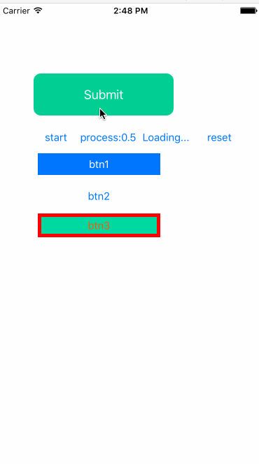
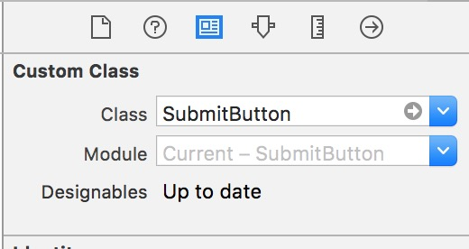
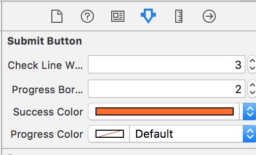

# SubmitButton

 An animated Submit Button written in Swift.




##Installation

just drag ```SubmitButton.swift``` to your project.


## How to use

1 create a button 

- using code 

```swift
        let frame = CGRect(x: 50, y: 100, width: 200, height: 60)
        button = SubmitButton(frame: frame)
        button.setTitle("Submit", forState: .Normal)
        self.view.addSubview(button)

```

- using Storyboard or XIB





2  (**Optional**) porperties to change button settings


```swift
   btn.checkLineWidth = 6.0
   btn.progressBorderWidth  = 5.0
   btn.successColor = UIColor(red:0, green:206/255, blue:148/255, alpha:1)
   btn.progressColor = UIColor(red:0, green:206/255, blue:148/255, alpha:1) 
```

3 (**Optional**) button stateChanged callback

``` Swift
  btn1.stateChanged = {
            (toState:SubmitButtonState) in
            if toState == .Loading {
                self.btn1.progress  = 1
            }
  }
```

4 changing button state

```swift
@IBAction func btnClicked(_ sender: AnyObject) {
        let btn = sender as! SubmitButton
        if btn.submitState != .Normal  {
            btn.changeState(.Normal)

        } else {
            btn.changeState(.Loading)
        }
    }
``` 
5 setting progress

```swift
  ...
   btn.progress = 1
  ...
```


## Requirements
- swift3 +
- xcode8 +